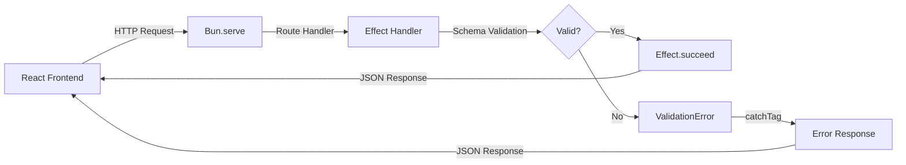

# Bun + React + Effect Example


**The `bun init` React + shadcn/ui starter, made 100% type-safe with Effect TypeScript.**

This demonstrates **END-TO-END TYPE SAFETY** using Effect for runtime validation, typed error channels, and exhaustive pattern matching. Built with Bun runtime, React 19, Tailwind CSS v4, and shadcn/ui for reusable components.

> [!IMPORTANT]
> Zero runtime type errors guaranteed through Effect's typed error channels, Schema validation, and compile-time exhaustive error handling.

## Stack

| Layer | Technology |
|-------|------------|
| **Runtime** | Bun |
| **Frontend** | React 19, Tailwind CSS v4, shadcn/ui |
| **Backend** | Bun.serve with Effect-based handlers |
| **Validation** | Effect Schema with runtime type checking |
| **Build** | Bun.build with Effect error handling |

## Commands

```bash
bun install    # Install dependencies
bun dev        # Development server with HMR
bun start      # Production server
bun build      # Build for production (supports CLI args)
```

## Structure

```
src/
├── index.ts        # Server entry with typed Effect handlers
├── App.tsx         # React root component
├── APITester.tsx   # API test UI with Schema validation
├── frontend.tsx    # React entry with HMR support
├── lib/
│   ├── errors.ts   # Tagged errors (ValidationError, HttpError, etc.)
│   └── utils.ts    # Utility functions (cn)
└── components/ui/  # shadcn/ui components
build.ts            # Production build with Effect + CLI args
```

## Architecture



## Type Safety

> [!NOTE]
> Every value is explicitly typed with zero `any` types or type assertions in the entire codebase.

### Zero Runtime Type Errors

- **No `any` types** - every value explicitly typed
- **No type assertions** - Effect Schema validates at runtime
- **Tagged errors** - `Data.TaggedError` for exhaustive pattern matching
- **Typed error channels** - `Effect.Effect<Success, Error>` with explicit error types

<details>
<summary>Example: Type-safe error handling</summary>

```typescript
const getHelloByName = (name: string): Effect.Effect<HelloByNameResponse, ValidationError> =>
  Effect.gen(function* () {
    if (!name.trim()) {
      return yield* new ValidationError({
        message: "Name parameter is required",
        cause: { endpoint: "/api/hello/:name", value: name }
      });
    }
    return { message: `Hello, ${name}!` };
  });
```

The error type is enforced at compile time. Handlers must use `Effect.catchTag("ValidationError", ...)` to recover.

</details>

### Frontend Validation

- API responses validated with `Schema.Struct` and `Schema.Union`
- `Effect.catchTag` enables type-safe error recovery by error tag
- Form inputs validated before API calls with `Schema.decodeUnknownEither`

### Build System

> [!TIP]
> Run `bun build --help` to see all available CLI options for the Effect-based build script.

- Effect-based build script with tagged error types (`CleanError`, `BuildError`)
- CLI argument parsing with automatic type coercion
- Resource cleanup with `Effect.acquireRelease`
